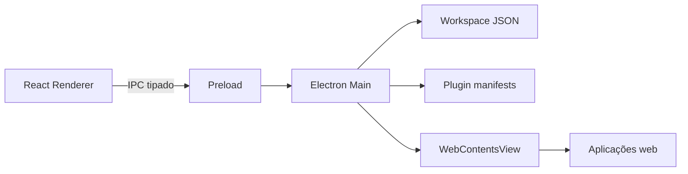

# Arquitetura

## Visão geral

O Sales OS possui três camadas:

1. **Main process:** controla janela, conteúdo Chromium, catálogo, persistência e arquivos.
2. **Preload:** expõe uma API pequena e tipada ao renderer por `contextBridge`.
3. **Renderer:** interface React sem acesso direto ao sistema operacional.

## Execução dos aplicativos

Cada plugin é aberto em um `WebContentsView`. A sessão usa uma partição persistente própria (`persist:sales-os-<plugin-id>`), preservando cookies e login e evitando compartilhar sessão acidentalmente entre aplicativos.

As views abertas são mantidas vivas em segundo plano. Cada aplicativo pode possuir várias `WebContentsView`, uma por aba, todas usando a mesma partição persistente. Assim, as abas compartilham autenticação e cookies dentro do aplicativo, mas permanecem isoladas dos demais plugins.

Alternar para o workspace apenas oculta as views; selecionar o ícone lateral ou uma aba volta ao mesmo DOM e estado de navegação, sem recarregar. Solicitações de nova janela HTTP/HTTPS são interceptadas e transformadas em abas internas. Aplicativos, URLs e aba ativa são persistidos e restaurados quando o Sales OS reinicia.

O shell ocupa a sidebar e a barra superior. O conteúdo do plugin é posicionado abaixo dessas áreas pelo processo principal.

## Fluxo

## Persistência

O estado fica em `app.getPath('userData')/workspace.json`. O repositório local pode ser substituído por uma implementação remota sem alterar os componentes da interface.

## Decisões de segurança

- isolamento de contexto e sandbox;
- sem Node.js no renderer;
- validação de protocolo em plugins customizados;
- navegação externa aberta no navegador padrão;
- permissões sensíveis negadas quando ausentes no manifesto;
- nenhuma captura ou controle remoto neste corte.
